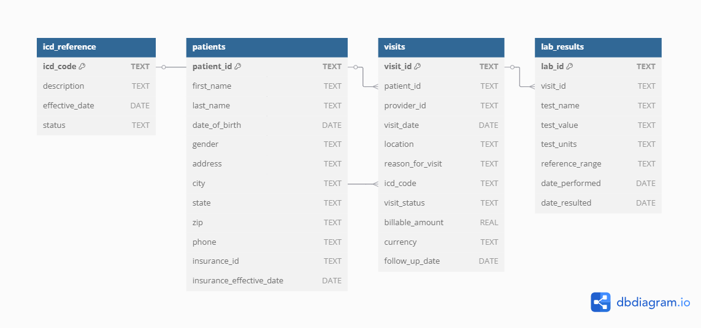

# EMR Pipeline (GoHealth Assessment) | James Ezeilo

## Overview

An ETL pipeline for processing Electronic Medical Records (EMR) data into a structured SQLite database for analytics and reporting.

## Design Decisions

_NOTE: Most design decisions were based off assumptions made of what the hypothetical analytics team would prefer such as formatting for dates, currency, phone numbers along with invalid values for names, addresses, etc._

**Modular Architecture**
   - Separate modules for extraction, transformation, and loading
   - Each data type (patients, visits, labs, ICD codes) has its own transformation logic
   - Relatively easy and simple to test and maintain

**Data Validation**
   - Individual validation and transformation for each CSV file
   - Invalid data is replaced with NaN rather than failing the pipeline (assuming that's preferred by analytics team)
   - Logging validation issues for easy debugging (using "INFO" rather than "DEBUG" mode to prevent patient data from being logged)
   - Standardized formats for dates, phone numbers, and other fields based on researched preferences like ISO8601 for dates

**Data Flow**
   ```
   Excel File (source) → CSV Extraction → Data Validation → SQLite Database
   ```
[View Full Architecture Diagram](https://www.canva.com/design/DAGpGApEZUk/4qgSzW7LkrOFZo-9N9Q4lg/view?utm_content=DAGpGApEZUk&utm_campaign=designshare&utm_medium=link2&utm_source=uniquelinks&utlId=h34aca163d1)



## Dependencies

- Used pandas (2.0.0) and numpy (1.24.0) for data manipulation and transformation
- Used loguru (0.7.0) for logging
- openpyxl (3.1.0) for Excel file handling
- sqlite3 for databasing